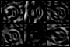

# **Traffic Sign Recognition** 

## Writeup
## Thomas Smith 

---

**Build a Traffic Sign Recognition Project**

The goals / steps of this project are the following:
* Load the data set (see below for links to the project data set)
* Explore, summarize and visualize the data set
* Design, train and test a model architecture
* Use the model to make predictions on new images
* Analyze the softmax probabilities of the new images
* Summarize the results with a written report

[//]: # (Image References)

[image1]: ./writeup_images/img_all_classes.png "Training images from each class"
[image2]: ./writeup_images/orig_data_bar.png "Examples by class"
[image3]: ./writeup_images/normal_bar.png "Normalised distribution by class"
[image4]: ./writeup_images/vert_flip.png "Vertical flip"
[image5]: ./writeup_images/hor_flip.png "Horizontal flip"
[image6]: ./writeup_images/180.png "180"
[image7]: ./writeup_images/flip_swap.png "Flip to new class"
[image8]: ./writeup_images/transform_bar.png "Training examples by class after transform"
[image9]: ./writeup_images/jitter.png "Jittered image"
[image10]: ./writeup_images/jitter_bar.png "Training examples by class of final dataset"
[image11]: ./writeup_images/px_dist.png "Distribution of pixel values in preprocessed dataset"
[image12]: ./writeup_images/web_signs.png "German traffic signs sourced from the internet"
[image13]: ./writeup_images/test_results.png "Predicted classes for German traffic signs sourced from the internet"
[image14]: ./writeup_images/softmax.png "Top5 classes for German traffic signs sourced from the internet"
[image15]: ./writeup_images/visualize_cnn.png "Visualization of convolutional output"

## Rubric Points
### Here I will consider the [rubric points](https://review.udacity.com/#!/rubrics/481/view) individually and describe how I addressed each point in my implementation.  

---
### Writeup / README

#### 1. Provide a Writeup / README that includes all the rubric points and how you addressed each one. You can submit your writeup as markdown or pdf. You can use this template as a guide for writing the report. The submission includes the project code.

This document details the work comleted and how the rubric points have been addressed. The project code can be accessed [here](https://github.com/tmssmith/CarND-Traffic-Sign-Classifier-Project/blob/master/Traffic_Sign_Classifier.ipynb) 

### Data Set Summary & Exploration

#### 1. Provide a basic summary of the data set. In the code, the analysis should be done using python, numpy and/or pandas methods rather than hardcoding results manually.

I used the numpy library to calculate summary statistics of the traffic
signs data set:

* The size of training set is 34799
* The size of the validation set is 4410
* The size of test set is 12630
* The shape of a traffic sign image is (32, 32, 3)
* The number of unique classes/labels in the data set is 43

#### 2. Include an exploratory visualization of the dataset.

The below figure shows a single training example from each of the classes in the dataset. 

![Training examples from each class][image1]

The dataset is seperated into training, validation and test images across all of the classes. The barchart below shows the distribution of images across the classes.

![Distribution of examples by class][image2]

It is apparent from the  graph that the images in the dataset are not evenly distribution across all of the classes. There is an average of 809 training images for each class, but lowest number of training images in a class is only 180. 

The large range in the distribution of images over the classes could lead to bias in the learnt model, where some classes are better represented and therefore more likely to be correctly classified. In addition, 180 examples may not be sufficient to train the model to classify the class.

Normalising the distribution of examples types within each class allows us to see what proportion of the images for a given class are used for training, validation and test. The figure below shows this normalised distribution. It is apparent that each class is fairly similarly distributed, with approximately 65% of the images in each class being in the training set, 5 % in the validation set and 20% in the testing set.

![Normalised distribution of examples by class][image3]

### Design and Test a Model Architecture

#### 1. Describe how you preprocessed the image data. What techniques were chosen and why did you choose these techniques? Consider including images showing the output of each preprocessing technique. Pre-processing refers to techniques such as converting to grayscale, normalization, etc. (OPTIONAL: As described in the "Stand Out Suggestions" part of the rubric, if you generated additional data for training, describe why you decided to generate additional data, how you generated the data, and provide example images of the additional data. Then describe the characteristics of the augmented training set like number of images in the set, number of images for each class, etc.)

Having explored the distribution of the provided dataset it I decided to augmented the training dataset to both increase the absolute number of training examples in each class and to reduce the variation in numbers of training images across the classes.

#### Image Transforms:

The first augmentation technique was to use a series of image transforms to generate new training images from the original examples. The following transforms are used, depending on the class.

##### Vertical Flip
Images from some classes can be flipped vertically to create a new example in the same class.

![Vertical flip][image4]

##### Horizontal Flip
Images from some classes can be flipped horizontally to create a new example in the same class.

![Vertical flip][image5]

##### $180^o$  rotation
Images from some classes can be rotated $180^o$ to create a new example in the same class.

![Vertical flip][image6]

##### Flip and change class
Images from some classes can be flipped to create new examples from a different class.

![Vertical flip][image7]

Performing these transforms on all images in the appropriate classes increased the number of training examples by 24,989 images. The new distribution of training examples by class is shown below.

![Distribution by class after transform][image8]

Unfortunately it is apparent that many of the classes that were already well represented have been augmented while many of the classes which were underrepresented haven't been increased in size at all. As such, further augmentation is required

#### Image Jittering:
Another technique to augment the training dataset is to 'jitter' the images. This involves making small random changes to the image. In this project I apply rotation, translation and scaling to the images. The magnitude of the jitter is kept small to avoid producing images that stray too far from the original. An example of a jittered image is shown below. The jittering process is carried out with each class until there are at least 2000 training examples in that class to produce a more even distribution of images across the classes.

![Jittered image][image9]

After jittering the final dataset now includes 112,134 training images. The distribution of training images across the classes is shown below. The distribution is much more even and all classes have at least 2000 training examples.

![Distribtion by class of final dataset][image10]

#### Data Normalization

The image data was normalized and centered around zero to improve the numerical stability of the model and reduce training time. The following equations were used to normalize and center the data:

$$ x_{norm} = \frac{x}{255} $$

$$ x_{center} = x_{norm} - \bar{x}_{norm} $$

For some experiments the dataset was converted to grayscale while others were left as color images.

The distribution of pixel values after normalizing and centering the data is shown below.

![Pixel value distribution][image11]

#### 2. Describe what your final model architecture looks like including model type, layers, layer sizes, connectivity, etc.) Consider including a diagram and/or table describing the final model.

My final model consisted of the following layers:

| Layer         		|     Description	        					| 
|:---------------------:|:---------------------------------------------:| 
| Input         		| 32x32x1 grayscale preprocessed image   		| 
| Convolution 5x5     	| 1x1 stride, valid padding, outputs 28x28x6 	|
| RELU					|												|
| Max pooling	      	| 2x2 stride,  outputs 14x14x6, valid padding	|
| Convolution 5x5	    | 1x1 stride, valud padding, outputs 10x10x16   |
| RELU					|												|
| Max pooling	      	| 2x2 stride,  outputs 5x5x16, valid padding	|
| Fully connected		| 400 input, output 120   						|
| RELU					|												|
| Dropout				| 0.5 drop rate									|
| Fully connected		| 120 input, 84 output   						|
| RELU					|												|
| Dropout				| 0.5 drop rate									|
| Fully connected		| 84 input, 43 output (logits)					|
| Softmax				|           									|

#### 3. Describe how you trained your model. The discussion can include the type of optimizer, the batch size, number of epochs and any hyperparameters such as learning rate.

To train the model, I used an Adam optimizer over 50 epochs with a learning rate of 0.001 and a drop rate of 0.5. The batch size was 256.

#### 4. Describe the approach taken for finding a solution and getting the validation set accuracy to be at least 0.93. Include in the discussion the results on the training, validation and test sets and where in the code these were calculated. Your approach may have been an iterative process, in which case, outline the steps you took to get to the final solution and why you chose those steps. Perhaps your solution involved an already well known implementation or architecture. In this case, discuss why you think the architecture is suitable for the current problem.

A number of experiments were conducted with various architectures and hyperparameters. The architectures used were: 
 - LeNet and variations
 - Two-stage network as described [here](http://yann.lecun.com/exdb/publis/pdf/sermanet-ijcnn-11.pdf)
 - Global average pooling with three convolutional layers and a global average layer
 - 'deepConv' with five convolutional layers and a fully connected layer
 
These architectures are defined fully in the project code. Unfortunately due to hardware and time constraints it wasn't feasible to fully train the more complex architectures. The best performing architecture was found to be the modified LeNet architecture with grayscale input images, as described above.

My final model results were:
* training set accuracy of 96.4%
* validation set accuracy of 97.7% 
* test set accuracy of 95.24%

### Test a Model on New Images

#### 1. Choose five German traffic signs found on the web and provide them in the report. For each image, discuss what quality or qualities might be difficult to classify.

Here are fifteen German traffic signs that I found on the web:

![German traffic signs from the web][image12]

Some of the images may be difficult for the model to classify correctly for the following reasons:
 - Image 2 has an overly exposed line making it difficult to see the '0' clearly
 - Image 3 has a foreign object occluding the view of the sign perimeter
 - Image 15 is overly exposed and difficult to determine 

#### 2. Discuss the model's predictions on these new traffic signs and compare the results to predicting on the test set. At a minimum, discuss what the predictions were, the accuracy on these new predictions, and compare the accuracy to the accuracy on the test set.

Here are the results of the prediction shown above the corresponding image:

![Predicted classes for the web images][image13]

The model was able to correctly classify 15 of the 15 traffic signs, which gives an accuracy of 100%.

#### 3. Describe how certain the model is when predicting on each of the five new images by looking at the softmax probabilities for each prediction. Provide the top 5 softmax probabilities for each image along with the sign type of each probability. 

The below image shows the top 5 predictions for each image. 

![Top5 predictions][image14]

14 out of the fifteen images are correctly classified with a confidence of over 98%, with most classifications at 100% confidence.  The third image is correctly predicted with a value of 73%, with a 26% confidence that it is a 80km/h sign. It's not immediately clear why the classifier was less confident on this image, although the sign perimeter is occluded by a foreign object.

For the first image, the model is relatively sure that this is a stop sign (probability of 0.6), and the image does contain a stop sign. The top five soft max probabilities were

### Visualizing the Neural Network (See Step 4 of the Ipython notebook for more details)
#### 1. Discuss the visual output of your trained network's feature maps. What characteristics did the neural network use to make classifications?

The figure below shows a visualization of the output of the first convolutional layer of the final model. It allows us to see the features of interest to the model. The model appears to be mostly detecting edges.

